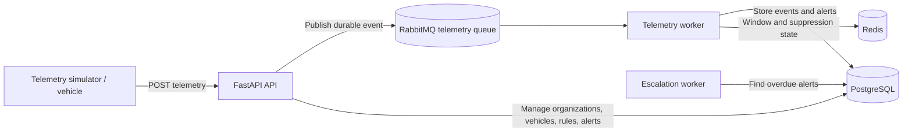

# MotorQ

Telematics alert engine built with FastAPI, PostgreSQL, Redis, and RabbitMQ.



## Setup

```bash
# Build and start the API, telemetry worker, escalation worker, PostgreSQL, Redis,
# and RabbitMQ
docker compose up -d --build

# The one-shot migrate container applies Alembic migrations before API/worker startup.
```

To run migrations manually after adding a migration:

```bash
docker compose run --rm migrate
```

For local development without the API container, start the backing services with
`docker compose up -d postgres redis rabbitmq`, then use `uv sync`, `uv run
alembic upgrade head`, and `uv run uvicorn app.main:app --reload`.

## API Examples

### Create Organization

```bash
curl -X POST http://localhost:8000/api/v1/organizations \
  -H "Content-Type: application/json" \
  -d '{"name": "Acme Corp"}'
```

### Create Vehicle

```bash
curl -X POST http://localhost:8000/api/v1/vehicles \
  -H "Content-Type: application/json" \
  -d '{"organization_id": 1, "vin": "VIN1234567890", "display_name": "Truck 01"}'
```

### Send Telemetry

```bash
curl -X POST http://localhost:8000/api/v1/telemetry \
  -H "Content-Type: application/json" \
  -d '{
    "event_id": "event-001",
    "organization_id": 1,
    "vehicle_id": "VIN1234567890",
    "timestamp": "2026-08-03T10:45:00Z",
    "speed_mph": 65,
    "fuel_level_percent": 42,
    "engine_state": "on",
    "odometer_miles": 12050,
    "latitude": 12.9716,
    "longitude": 77.5946
  }'
```

**Response (HTTP 202):**

```json
{
  "event_id": "event-001",
  "organization_id": 1,
  "status": "accepted"
}
```

Telemetry is accepted only after it is durably published to the RabbitMQ
`telemetry` queue. The telemetry worker consumes that queue, writes the event to
PostgreSQL, and evaluates rules. Start it locally with:

```bash
uv run python -m app.workers.telemetry
```

### Create a Simple Rule

```bash
curl -X POST http://localhost:8000/api/v1/rules \
  -H "Content-Type: application/json" \
  -d '{
    "organization_id": 1,
    "name": "Speed above 70 mph",
    "rule_type": "simple",
    "field": "speed_mph",
    "operator": ">",
    "threshold": 70,
    "suppress_for_seconds": 600,
    "escalate_after_seconds": 900
  }'
```

### Manage Rules

```bash
curl "http://localhost:8000/api/v1/rules?organization_id=1"

curl -X PATCH "http://localhost:8000/api/v1/rules/1?organization_id=1" \
  -H "Content-Type: application/json" \
  -d '{"enabled": false}'

curl -X DELETE "http://localhost:8000/api/v1/rules/1?organization_id=1"
```

### Create a Windowed Rule

This alert triggers after three speeding events within five minutes:

```bash
curl -X POST http://localhost:8000/api/v1/rules \
  -H "Content-Type: application/json" \
  -d '{
    "organization_id": 1,
    "name": "Repeated speeding",
    "rule_type": "windowed",
    "field": "speed_mph",
    "operator": ">",
    "threshold": 70,
    "window_seconds": 300,
    "min_matching_events": 3
  }'
```

### Manage Alerts

When telemetry matches a rule, the API creates one open alert for that rule and
vehicle. Further matching telemetry updates the same unresolved alert instead
of creating duplicates.

```bash
# List all alerts for an organization, or add &status=open to filter
curl "http://localhost:8000/api/v1/alerts?organization_id=1"

# Mark an alert as seen
curl -X POST "http://localhost:8000/api/v1/alerts/1/acknowledge?organization_id=1"

# Resolve an alert
curl -X POST "http://localhost:8000/api/v1/alerts/1/resolve?organization_id=1"
```

### Run the Escalation Worker

The worker checks once per minute and changes overdue unacknowledged `open`
alerts to `escalated`. Run one worker instance:

```bash
uv run python -m app.workers.escalation
```

Rules with `suppress_for_seconds` greater than zero use Redis to throttle
repeated matching pings. If Redis is unavailable, alerts continue processing.

### Run the Telemetry Simulator

The simulator can create development vehicles, move them using coordinates, and
send batches of telemetry. This example sends three mixed-scenario vehicles
every second for ten iterations:

```bash
uv run --group dev python -m simulator.telemetry \
  --organization-id 1 \
  --vehicle-count 3 \
  --create-vehicles \
  --scenario mixed \
  --interval 1 \
  --iterations 10
```

Use `--scenario normal`, `speeding`, or `low-fuel` for a fixed scenario. Pass
`--vehicle-ids VIN123,VIN456` to send telemetry for existing vehicles instead.
Use `--speed-mph 105` to send a fixed speed for a windowed-speed-rule demo.

To create a complete demo organization, drivers, vehicles, and rules:

```bash
bash scripts/init_demo.sh
```

The script needs `curl` and `jq`. In Fish, then run `source /tmp/motorq-demo.fish`
to load the generated organization and vehicle variables.

## Commands

```bash
# Create migration
uv run alembic revision --autogenerate -m "description"

# Apply migrations
uv run alembic upgrade head

# Rollback
uv run alembic downgrade -1
```

## Endpoints

| Method | Path | Description |
|--------|------|-------------|
| GET | /health | Health check |
| POST | /api/v1/organizations | Create organization |
| GET | /api/v1/organizations/{id} | Get organization |
| PATCH | /api/v1/organizations/{id} | Update organization |
| POST | /api/v1/users | Create user |
| GET | /api/v1/users?organization_id= | List users |
| POST | /api/v1/drivers | Create driver |
| GET | /api/v1/drivers?organization_id= | List drivers |
| POST | /api/v1/vehicles | Create vehicle |
| GET | /api/v1/vehicles?organization_id= | List vehicles |
| POST | /api/v1/vehicles/{id}/assign-driver | Assign driver |
| POST | /api/v1/telemetry | Send telemetry |
| POST | /api/v1/rules | Create a simple rule |
| GET | /api/v1/rules?organization_id= | List organization rules |
| GET | /api/v1/rules/{id}?organization_id= | Get rule |
| PATCH | /api/v1/rules/{id}?organization_id= | Update rule |
| DELETE | /api/v1/rules/{id}?organization_id= | Delete rule |
| GET | /api/v1/alerts?organization_id= | List organization alerts |
| POST | /api/v1/alerts/{id}/acknowledge?organization_id= | Acknowledge alert |
| POST | /api/v1/alerts/{id}/resolve?organization_id= | Resolve alert |
